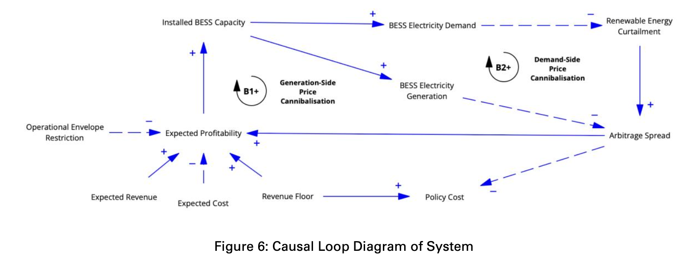
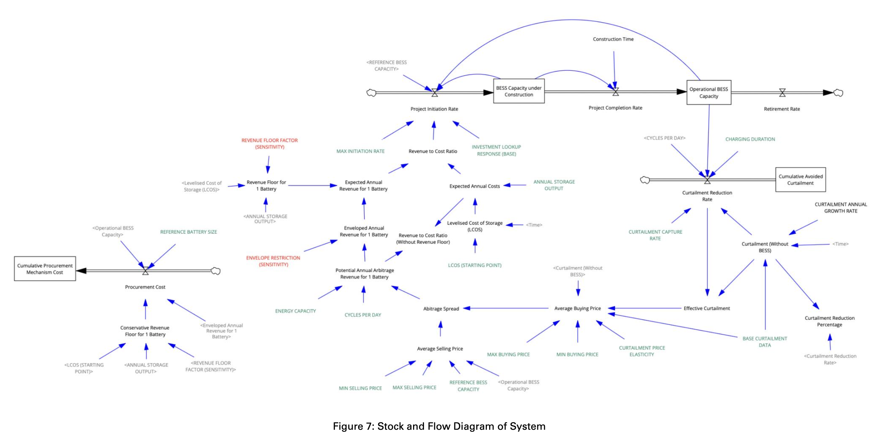
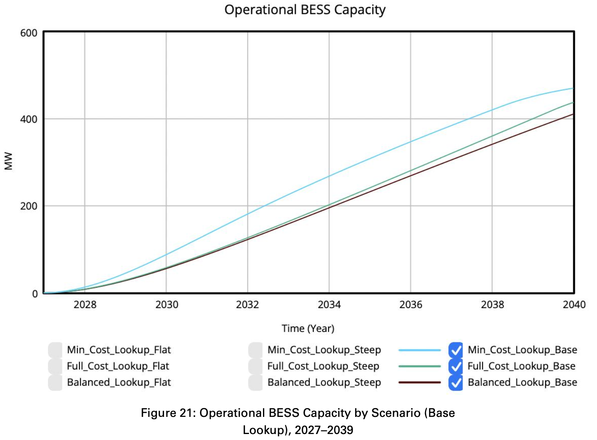
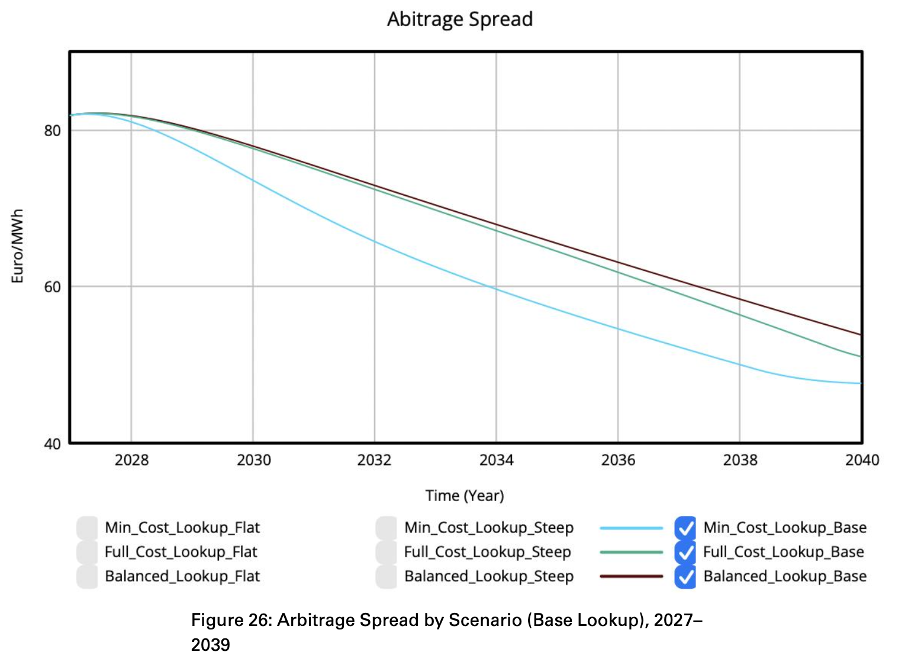
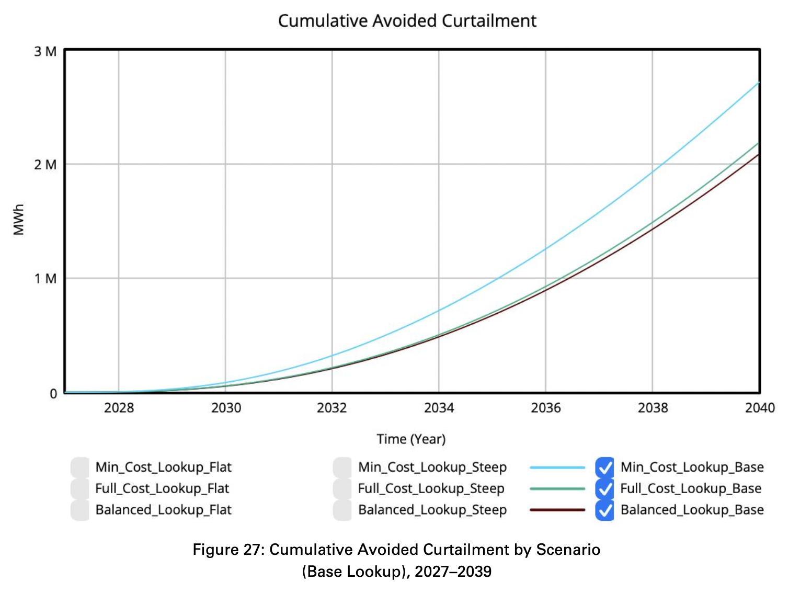
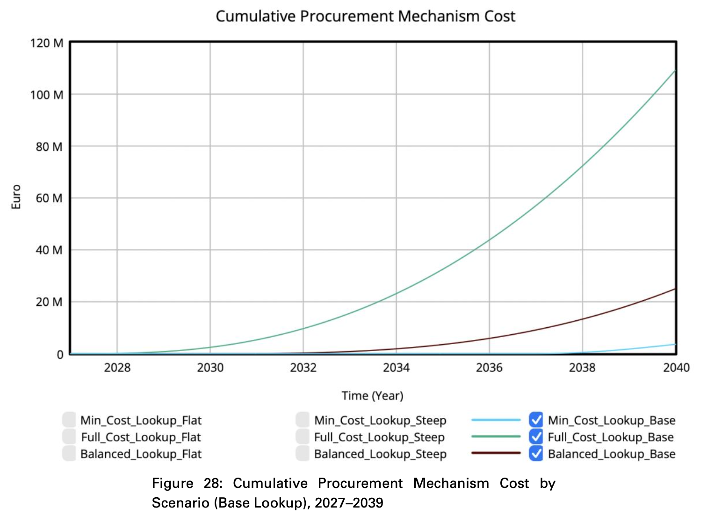

# The Impact of Ireland's Proposed LDES Procurement Mechanism on Battery Storage Deployment: A System Dynamics Simulation

[](https://vensim.com/)
[](#)
[](#)

A quantitative System Dynamics simulation investigating how EirGrid's proposed Long-Duration Energy Storage (LDES) procurement mechanism influences private battery investment, wholesale price cannibalisation, renewable curtailment, and public policy costs in Ireland.

Developed as a Master's thesis for the **MSc in Transition, Innovation and Sustainability Environments (TISE)**.

---

## 📌 Context & Problem Statement

Ireland has committed to generating at least **80% of its electricity from renewable sources by 2030**. However, high penetration of non-synchronous wind and solar has driven rapid increases in renewable curtailment (reaching over 659 GWh in 2024, with projections up to 45% without mitigation). 

While 4-hour Battery Energy Storage Systems (BESS) are critical for shifting surplus clean energy to peak demand periods, EirGrid's analysis identifies a **"missing money" problem**: projected merchant revenues from wholesale energy arbitrage alone are insufficient to recover the full Levelised Cost of Storage (LCOS).

To bridge this gap, EirGrid proposed a procurement mechanism combining two countervailing policy instruments:
1. **A Revenue Floor:** Guarantees a minimum annual income to protect developers from downside revenue risk.
2. **An Operational Envelope:** Grants the Transmission System Operator (TSO) dispatch control over a fraction of battery capacity to manage grid stability and curtailment.

---

## 🔄 System Architecture

The simulation models the feedback dynamics between market price formation, investor behaviour, and grid physical constraints across five interconnected sub-models: **BESS Deployment, Curtailment Dynamics, Electricity Price Dynamics, Investment Profitability, and Policy Cost**.

### 1. Causal Loop Diagram (CLD)
The conceptual model captures two key balancing feedback loops governing storage economics:
* **Generation-Side Price Cannibalisation (B1):** As battery discharge capacity scales, additional peak supply displaces expensive marginal gas generation, depressing peak selling prices and compressing arbitrage spreads.
* **Demand-Side Price Cannibalisation (B2):** As battery charging scales during low-demand periods, additional demand absorbs excess renewables and raises trough buying prices, further eroding spreads.



### 2. Stock and Flow Diagram (SFD)
The model was formulated and executed in **Vensim PLE** over a 12-year horizon (2027–2039) with a 500 MW total procurement cap:
* **Stocks:** `BESS Capacity under Construction`, `Operational BESS Capacity`, `Cumulative Avoided Curtailment`, and `Cumulative Procurement Mechanism Cost`.
* **Delays & Constraints:** 2-year first-order construction delay; Dixit-Pindyck irreversible investment hurdle rates parameterised via Sterman's 9-step table function methodology (`Investment Lookup Response`).



---

## 🧪 Policy Scenarios Evaluated

The study simulated three regulatory designs across three investor behavioural curves (**Base**, **Steep**, **Flat**), generating **nine simulation runs**:

| Policy Scenario | Revenue Floor Factor ($\phi$) | Envelope Restriction ($\rho$) | Strategic Design |
| :--- | :---: | :---: | :--- |
| **Minimal Cost Recovery** | **0.70** | **0.20** | Light-touch: High merchant freedom, minimal downside safety net. |
| **Balanced** | **0.90** | **0.30** | Compromise: Moderate revenue floor with 30% dispatch restriction. |
| **Full Cost Recovery** | **1.00** | **0.70** | Heavy underwriting: 100% cost floor with 70% TSO operational control. |

---
## 📊 Key Simulation Findings

| Finding 1: Operational BESS Capacity | Finding 2: Arbitrage Spread Compression |
| :---: | :---: |
|  |  |

| Finding 3: Cumulative Avoided Curtailment | Finding 4: Cumulative Policy Cost |
| :---: | :---: |
|  |  |

1. **The Light-Touch Paradox (Baseline €60/MWh LCOS):**
   * Under baseline capital costs, **Minimal Cost Recovery** deployed the highest operational capacity by 2039 (**470.4 MW** vs 410.9 MW for Balanced).
   * It also delivered the greatest cumulative avoided curtailment (**2.71M MWh**) at the lowest cumulative policy cost (**€3.61M** vs **€109.3M** for Full Cost Recovery).
   * On a value-for-money basis, Minimal Cost Recovery was **63× more cost-effective** per unit of avoided curtailment (€0.65/MWh vs €41.03/MWh).
   * *Mechanism:* Day-Ahead arbitrage spreads were sufficient in early years to keep unconstrained economics above break-even; heavy operational restrictions damaged revenue upside far more than high floors helped.

2. **Policy Inversion Under High Storage Costs (€130/MWh LCOS):**
   * When tested against higher capital costs where merchant revenue cannot cover LCOS, the ranking **completely inverted**:
   * **Full Cost Recovery** delivered **400.2 MW**, whereas Minimal Cost Recovery collapsed to **200.1 MW**.
   * *Mechanism:* When market revenues fail, the Revenue Floor becomes the operative driver of capital deployment, rendering envelope restrictions secondary.

3. **Core Policy Recommendation:**
   * EirGrid's procurement design should **not** be treated as a static compromise. It must be structured as an **adaptive policy framework** that benchmarks changing storage capital costs, wholesale price spreads, and multivariable revenue stacking opportunities over time.

---

## 📂 Repository Contents

* `Vensim_Model.mdl`: Complete Vensim model equations, variables, and lookup table functions.
* `Thesis_Defense_Slides.pdf`: Thesis defense slide deck outlining methodology, equations, and scenario runs.
* `images/`: High-resolution exports of the Causal Loop Diagram, Stock & Flow Diagram, and simulation output charts.

---

## 💻 How to Run the Model

1. Download and install [Vensim PLE](https://vensim.com/vensim-personal-learning-edition/) or the free [Vensim Model Reader](https://vensim.com/vensim-model-reader/).
2. Clone this repository:
   ```bash
   git clone https://github.com/SpiderPig107/ireland-ldes-battery-simulation.git
3. Open `Vensim_Model.mdl` in Vensim.
4. Run simulations across scenarios by toggling REVENUE FLOOR FACTOR (0.7, 0.9, 1.0) and ENVELOPE RESTRICTION (0.2, 0.3, 0.7).
